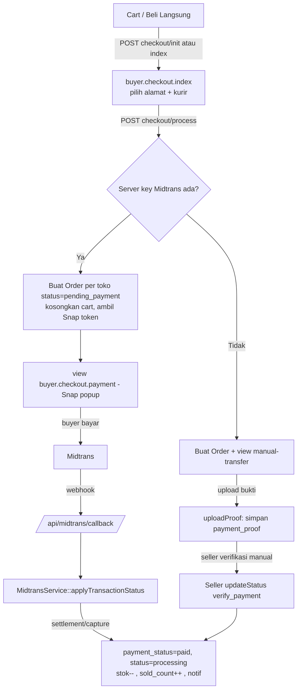
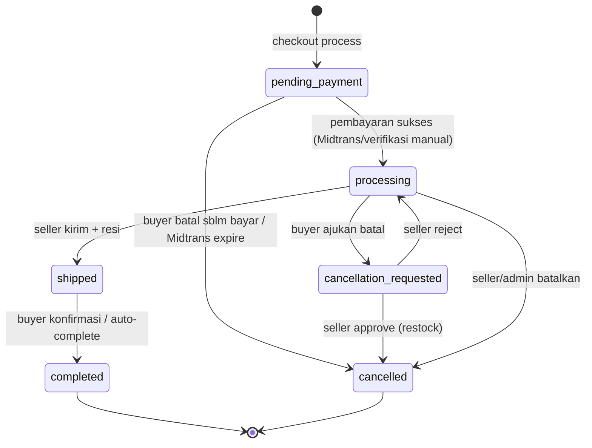
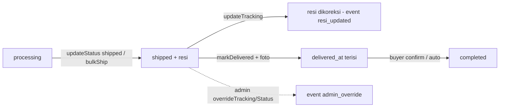
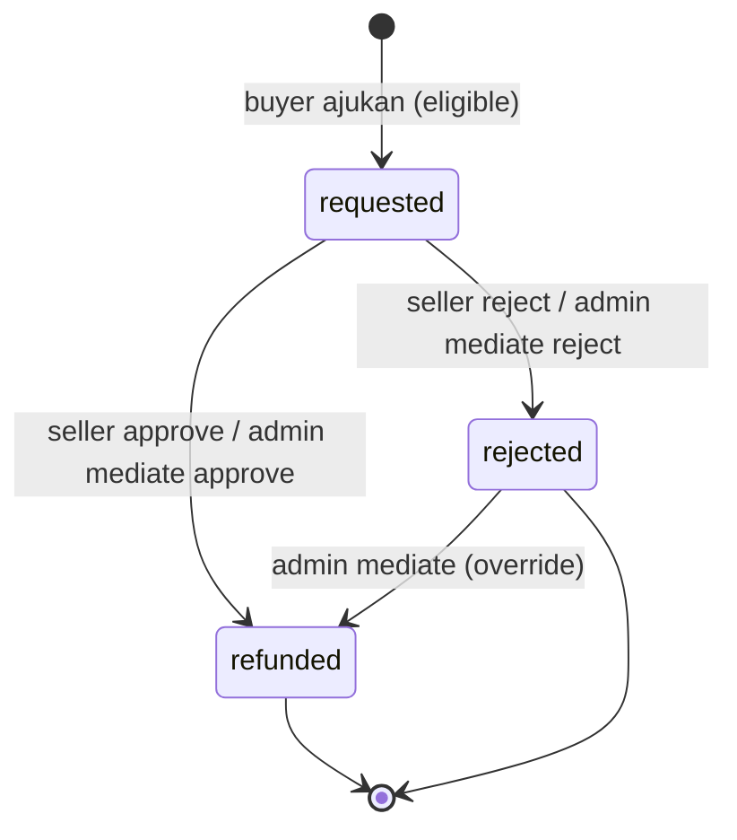
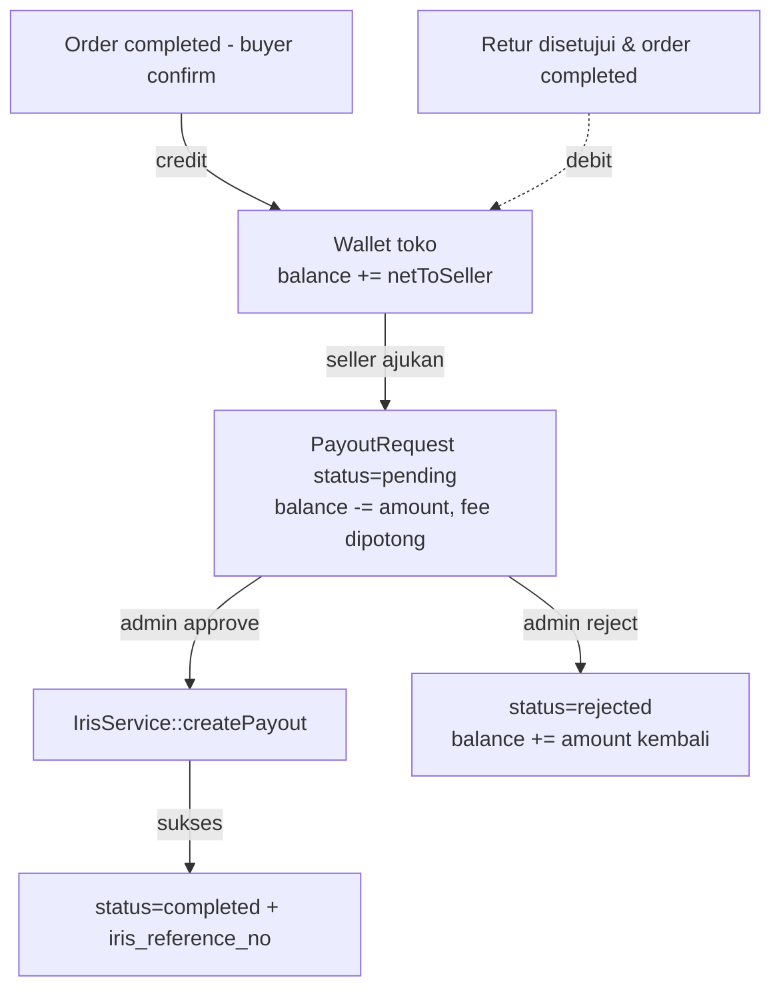
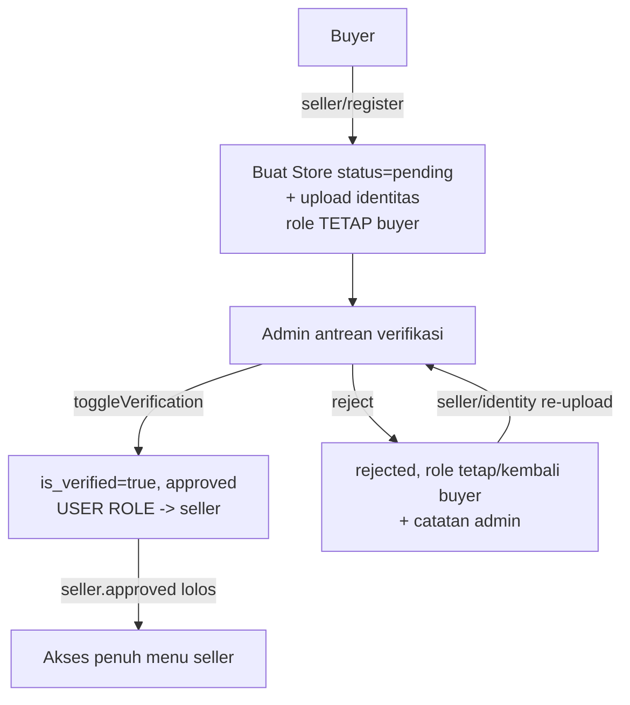

# 03 — Alur Bisnis & State Machine

[← Indeks](00-README.md)

Tiap flow di bawah menyebut **controller@method** pemicu transisi + **file:line** kunci. Nilai status lihat [04-MODELS.md](04-MODELS.md).

---

## Flow Checkout & Pembayaran

Buyer → halaman checkout → buat Order **per toko** → bayar via Midtrans Snap (atau manual transfer fallback).

**Detail penting:**
- `Beli Langsung`: [CheckoutController@init](../app/Http/Controllers/Buyer/CheckoutController.php#L26) membuat/meng-update 1 baris cart lalu memanggil `index()`.
- `process()` mengelompokkan item **per toko** dan membuat **satu Order untuk tiap toko**, semua berbagi `payment_reference` yang sama ([CheckoutController.php:190-272](../app/Http/Controllers/Buyer/CheckoutController.php#L190)). Ongkir: kurir internal `toko_*` pakai harga tetap; ekspedisi reguler via `RajaOngkirService` (fallback Rp25.000). `BuyerTransactionFee` aktif ditambahkan **sekali** ke order pertama.
- **Stok dikurangi saat PEMBAYARAN sukses**, bukan saat order dibuat ([MidtransService.php:100-105](../app/Services/MidtransService.php#L100)).
- Sinkronisasi status punya **3 jalur**: (1) webhook `/api/midtrans/callback`; (2) fallback `syncByReference()` saat buyer membuka `buyer.orders.index`/`show` ([Buyer\OrderController.php:22-30](../app/Http/Controllers/Buyer/OrderController.php#L22)); (3) verifikasi manual oleh seller untuk transfer.
- Pemetaan status Midtrans → order ada di [MidtransService@mapTransactionStatus](../app/Services/MidtransService.php#L154): `settlement`/`capture+accept` → `paid`; `cancel/deny/expire/failure` → `cancelled`; `pending` → tetap `pending_payment`.

---

## Flow Lifecycle Order

Kolom `orders.status`. Enum: `pending_payment`, `processing`, `cancellation_requested`, `shipped`, `completed`, `cancelled`.

| Transisi | Pemicu | Lokasi |
|----------|--------|--------|
| `pending_payment → processing` | Bayar sukses | [MidtransService.php:98](../app/Services/MidtransService.php#L98) / [Seller\OrderController@updateStatus](../app/Http/Controllers/Seller/OrderController.php#L143) (verify manual) |
| `pending_payment → cancelled` | Buyer batal sebelum bayar / Midtrans expire | [Buyer\OrderController@cancel:177](../app/Http/Controllers/Buyer/OrderController.php#L177) / [MidtransService.php:165](../app/Services/MidtransService.php#L165) |
| `processing → shipped` | Seller set "Dikirim" (+resi wajib) | [Seller\OrderController@updateStatus:156](../app/Http/Controllers/Seller/OrderController.php#L156), atau bulk: [Seller\ShipmentController@bulkShip](../app/Http/Controllers/Seller/ShipmentController.php#L96) |
| `processing → cancellation_requested` | Buyer ajukan batal | [Buyer\OrderController@cancel:195](../app/Http/Controllers/Buyer/OrderController.php#L195) |
| `cancellation_requested → cancelled/processing` | Seller approve/reject | [Seller\OrderController@resolveCancellation](../app/Http/Controllers/Seller/OrderController.php#L260) |
| `shipped → completed` | Buyer konfirmasi terima | [Buyer\OrderController@confirm:80](../app/Http/Controllers/Buyer/OrderController.php#L80) |
| `shipped → completed` (otomatis) | Lewat `auto_complete_hours` sejak `delivered_at` | `orders:auto-complete` ([AutoCompleteOrders](../app/Console/Commands/AutoCompleteOrders.php)) |
| `* → cancelled` (admin) | Override | [Admin\ShipmentController@overrideStatus](../app/Http/Controllers/Admin/ShipmentController.php#L66) |

> **Sub-tahap "delivered":** bukan status order tersendiri. Order tetap `shipped`, tapi `delivered_at` terisi saat [Seller\OrderController@markDelivered](../app/Http/Controllers/Seller/OrderController.php#L201) (wajib foto bukti). Ini memulai timer auto-complete. Pembedaan tab "Dikirim" vs "Sampai" memakai `whereNull/whereNotNull('delivered_at')`.

---

## Flow Pengiriman (Shipment)

Tanpa API kurir. Resi diinput manual; histori di tabel `shipment_events` via [ShipmentEvent::record()](../app/Models/ShipmentEvent.php).

- Seller "Manajemen Pengiriman" ([Seller\ShipmentController@index](../app/Http/Controllers/Seller/ShipmentController.php#L20)) bertab: `need_ship` (processing), `shipped` (shipped & belum delivered), `delivered` (shipped & sudah delivered), `completed`.
- `bulkShip`: hanya order `processing` dengan resi non-kosong yang diproses; sisanya di-skip.
- Label cetak: `seller.shipments.label`. Event tercatat: `shipped`, `resi_updated`, `delivered`, `cancelled`, `admin_override`, `return_refunded`.
- Admin bisa override resi/status lintas toko (dicatat sebagai `admin_override`).

---

## Flow Retur (Pengembalian Barang)

Tabel `order_returns`. Status: `requested`, `approved`, `rejected`, `refunded`, `cancelled`.

- **Syarat ajukan** ([Buyer\ReturnController@isEligible:86](../app/Http/Controllers/Buyer/ReturnController.php#L86)): order sudah diterima (`completed`, atau `shipped`+`delivered_at`), belum ada retur aktif, dan dalam `return_window_days` (default 7; `0` = fitur nonaktif).
- **Approve = refund + restock** dalam satu transaksi: [Seller\ReturnController::processRefund (static)](../app/Http/Controllers/Seller/ReturnController.php#L89). `refund_amount = total_price − shipping_cost`. Jika order sudah `completed` (dana sudah di wallet seller), saldo wallet **ditarik kembali** (`WalletTransaction` type `debit`, ref `RETURN-{id}`). Stok dikembalikan, event `return_refunded` dicatat.
- **Admin mediasi** ([Admin\ReturnController@mediate](../app/Http/Controllers/Admin/ReturnController.php#L37)) memanggil `processRefund(..., 'admin', ...)` yang sama — keputusan final, bisa override penolakan seller.

---

## Flow Wallet & Payout

- **Kredit ke wallet** terjadi saat buyer konfirmasi ([Buyer\OrderController@confirm:103-130](../app/Http/Controllers/Buyer/OrderController.php#L103)). `netToSeller = (total_price − shipping_cost) + ongkir_internal − platform_fee_per_item × qty`. Ongkir internal (`toko_*`) ikut masuk; ekspedisi reguler tidak. `WalletTransaction` type `credit`, ref `ORDER-{id}`.
- **Ajukan payout** ([Seller\WalletController@requestPayout:35](../app/Http/Controllers/Seller/WalletController.php#L35)): min Rp10.000, wajib data bank di profil toko. Saldo langsung dipotong; `fee = withdrawal_fee_percentage% × amount` (default 2%), `net_amount` = amount − fee. Catat `WalletTransaction` debit ref `PAYOUT-{id}`.
- **Approve** ([Admin\PayoutController@approve:20](../app/Http/Controllers/Admin/PayoutController.php#L20)): kirim `net_amount` ke rekening via [IrisService::createPayout](../app/Services/IrisService.php#L29). Sukses → `completed` + simpan `iris_reference_no`.
- **Reject** ([Admin\PayoutController@reject:71](../app/Http/Controllers/Admin/PayoutController.php#L71)): `rejected` + **kembalikan saldo** (credit ref `REFUND-PAYOUT-{id}`).

---

## Flow Onboarding Seller

- Registrasi ([SellerRegistrationController@register:34](../app/Http/Controllers/Seller/SellerRegistrationController.php#L34)) membuat `Store` `verification_status='pending'`, `is_active=false`, `is_verified=false`. **Role user belum berubah** — buyer masih buyer, tapi bisa masuk `seller.dashboard` (menu terkunci).
- Verifikasi admin ([Admin\StoreController@toggleVerification:50](../app/Http/Controllers/Admin/StoreController.php#L50)): `is_verified=true`, `is_active=true`, `verification_status='approved'`, lalu **`user->role='seller'`**. Mencabut verifikasi/`reject` → `user->role='buyer'`.
- Middleware [`seller.approved`](../app/Http/Middleware/EnsureSellerApproved.php) yang menjaga grup manajemen seller: tanpa toko → ke form daftar; toko belum approved → ke dashboard (menu nonaktif).
- Toko bisa kirim ulang dokumen via `seller.identity.*` untuk kembali ke antrean.

[← Indeks](00-README.md) · [Lanjut: Model & Data →](04-MODELS.md)
