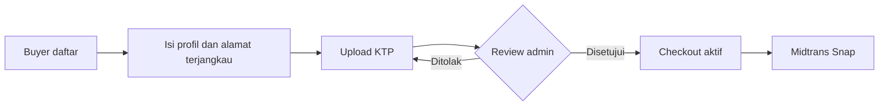

# Alur Bisnis

## Verifikasi dan checkout

Status KTP: `pending`, `verified`, atau `rejected`. Admin tidak perlu KTP. Checkout menolak buyer yang belum `verified`, alamat di luar whitelist, atau kode kurir selain `digital_hook_sameday`.

## Pesanan

1. Checkout membuat order `pending_payment` dengan stok belum berubah.
2. Callback/fallback Midtrans sukses mengubah order ke `processing` dan mengurangi stok tepat sekali.
3. Admin menyiapkan lalu mengirim menggunakan kurir Digital Hook.
4. Kurir/admin mengunggah bukti sampai; `delivered_at` dicatat.
5. Buyer mengonfirmasi atau command `orders:auto-complete` menutup order menjadi `completed`.

Pembayaran diterima langsung oleh merchant Digital Hook. Tidak ada pemindahan dana ke wallet seller atau proses payout.

## Pengiriman

Hanya Banten dengan tiga wilayah kota/kabupaten yang tampil. Kecamatan yang tidak ada di `config/digitalhook.php` dianggap tidak terjangkau. Tarif awal dibedakan per kota/kabupaten, dapat diubah admin melalui Pengaturan (termasuk Rp0/gratis), dan cutoff same-day dikendalikan `DIGITAL_HOOK_SAMEDAY_CUTOFF`.
