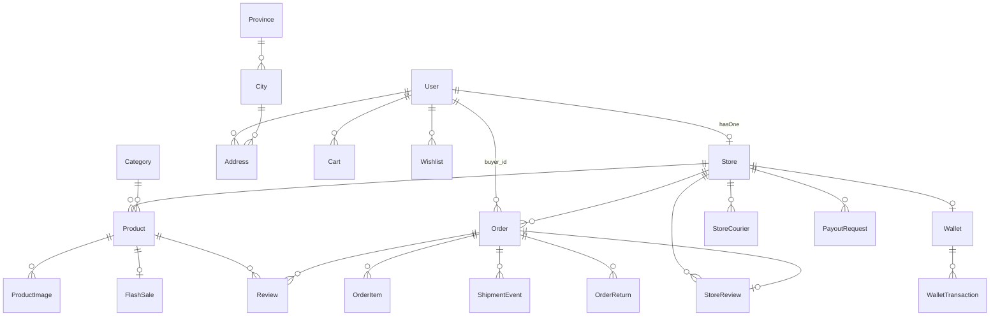

# 04 — Model, Relasi & Enum Status

[← Indeks](00-README.md)

25 model di [app/Models/](../app/Models/). Bagian paling penting untuk debugging adalah **enum status** di akhir dokumen.

---

## Diagram relasi inti

---

## Model per domain

### Akun & Toko
- **[User](../app/Models/User.php)** — `role` (admin/seller/buyer), `username`, `email`, `phone`, `is_active`, `pending_phone*` (verifikasi ganti HP), `security_question/answer/pin` (recovery). Relasi: `store` (hasOne), `orders` (buyer_id), `reviews` (buyer_id), `wishlists`, `carts`, `addresses`, `recoveryTickets`. Helper: `isAdmin/isSeller/isBuyer`, `avatar_url`.
- **[Store](../app/Models/Store.php)** — `user_id`, `city_id`, `name`, `slug`, `logo`, `banner`, `identity_document_path`, `identity_submitted_at`, `is_active`, `is_verified`, `verification_status`, `verified_at`, `enabled_expeditions` (array), `bank_name/account_no/account_name` (payout), `avg_rating`, `total_sold`. Const `EXPEDITIONS` = `jne/pos/tiki`. Helper: `isApproved()`, `activeExpeditions()`, `hasShippingOptions()`. Relasi: `user` (belongsTo), `products`, `orders`, `reviews` (→`StoreReview`), `storeCouriers`. **Wallet tidak punya relasi Eloquent di Store** — diakses via `Wallet::firstOrCreate(['store_id'=>...])`.
- **[RecoveryTicket](../app/Models/RecoveryTicket.php)** — `user_id`, `tipe_recovery`, `status`, `token_reset`, `expires_at`, `admin_notes`. Helper `isExpired()`.

### Katalog
- **[Product](../app/Models/Product.php)** — `store_id`, `category_id`, `name`, `slug`, `price` (int IDR), `stock`, `weight_gram`, `condition`, `status`, `sold_count`, `avg_rating`, `specs` (array JSON). Relasi: `store`, `category`, `images`, `primaryImage`, `reviews`, `flashSale`, `orderItems`. Helper: `isActive`, `isInStock`, `isOwnedBy(?User)`, `formatted_price`, `primary_image_url`.
- **[ProductImage](../app/Models/ProductImage.php)** — `product_id`, `image_path`, `is_primary`, `sort_order`. Accessor `url`.
- **[Category](../app/Models/Category.php)** — `name`, `slug`, `icon_svg`, `sort_order`, `is_active`.
- **[FlashSale](../app/Models/FlashSale.php)** — `product_id`, `discount_percent`, `original_price`, `sale_price`, `stock_flash`, `start_time`, `end_time`, `is_active`. Helper `isOngoing()`.
- **[Banner](../app/Models/Banner.php)** — `title`, `image_path`, `link_url`, `is_active`, `sort_order`. Accessor `image_url`.

### Transaksi
- **[Order](../app/Models/Order.php)** — `invoice_number` (unik), `buyer_id`, `store_id`, `status`, `total_price`, `shipping_cost`, `courier_name/service`, `shipping_etd`, `payment_method`, `payment_status`, `payment_token/reference/proof`, `shipping_address` (array), `applied_buyer_fees` (array), `shipping_tracking_number`, `shipped_at`, `delivered_at`, `delivery_confirmation_note`, `delivery_proof_path(s)`, `cancellation_reason/response/requested_at/resolved_at`. Relasi: `buyer`, `store`, `items`, `shipmentEvents`, `returns`/`latestReturn`, `reviews`, `storeReview`. Helper: `hasActiveReturn()`, accessor `status_label`, `status_color`, `courier_label`, `tracking_url` (null untuk kurir `toko_*`).
- **[OrderItem](../app/Models/OrderItem.php)** — `order_id`, `product_id`, `product_name_snapshot`, `price_snapshot`, `quantity`. Accessor `subtotal`. (Harga & nama **di-snapshot** saat order dibuat.)
- **[OrderReturn](../app/Models/OrderReturn.php)** — `order_id`, `buyer_id`, `store_id`, `status`, `reason`, `photos` (array), `seller_note`, `admin_note`, `refund_amount`, `refund_method`, `resolved_by_role/id`, `requested_at/resolved_at/refunded_at`. Helper `isActive()`.
- **[ShipmentEvent](../app/Models/ShipmentEvent.php)** — `order_id`, `event_status`, `description`, `tracking_number`, `actor_role`, `actor_id`. Static `record()`.

### Keuangan
- **[Wallet](../app/Models/Wallet.php)** — `store_id`, `balance` (decimal 15,2). 1 toko = 1 wallet (`firstOrCreate`).
- **[WalletTransaction](../app/Models/WalletTransaction.php)** — `wallet_id`, `type` (credit/debit), `amount`, `reference` (mis. `ORDER-x`, `PAYOUT-x`, `RETURN-x`, `REFUND-PAYOUT-x`), `description`.
- **[PayoutRequest](../app/Models/PayoutRequest.php)** — `store_id`, `amount`, `fee`, `net_amount`, `status`, `iris_reference_no`.
- **[BuyerTransactionFee](../app/Models/BuyerTransactionFee.php)** — `name`, `amount`, `is_active`. Fee yang dibebankan ke pembeli saat checkout.

### Ulasan & Keranjang
- **[Review](../app/Models/Review.php)** — `buyer_id`, `product_id`, `order_id`, `rating` (1-5), `comment`, `seller_reply`, `seller_replied_at`, `media` (array).
- **[StoreReview](../app/Models/StoreReview.php)** — `buyer_id`, `store_id`, `order_id`, `rating`, `comment`, `seller_reply`, `seller_replied_at`.
- **[Cart](../app/Models/Cart.php)** — `user_id`, `session_id`, `product_id`, `quantity`. Accessor `subtotal`.
- **[Wishlist](../app/Models/Wishlist.php)** — `user_id`, `product_id`.

### Pendukung
- **[Address](../app/Models/Address.php)** — `user_id`, `label`, `recipient_name`, `phone`, `full_address`, `city/province` (string + `city_id/province_id`), `postal_code`, `is_primary`, `latitude/longitude`. Accessor `full_label`. **`city_id` dipakai untuk hitung ongkir.**
- **[StoreCourier](../app/Models/StoreCourier.php)** — `store_id`, `name`, `price`, `estimation`, `is_active`. Kurir internal toko (kode checkout `toko_{name}`).
- **[Province](../app/Models/Province.php)** / **[City](../app/Models/City.php)** — master lokasi (`city.type` Kota/Kabupaten, `postal_code`).
- **[SystemSetting](../app/Models/SystemSetting.php)** — key-value config. Static `val(key, default)`. Key penting di tabel di bawah.

---

## Enum status (rujukan migration)

| Tabel.kolom | Nilai | Sumber |
|-------------|-------|--------|
| `users.role` | `admin`, `seller`, `buyer` (default `buyer`) | `2024_01_02_000001_modify_users_table.php` |
| `orders.status` | `pending_payment`, `processing`, `shipped`, `completed`, `cancelled` **+ `cancellation_requested`** | [create_orders:15](../database/migrations/2024_01_02_000006_create_orders_table.php#L15) + `2026_05_12_120000_add_cancellation_request_to_orders_table.php` |
| `orders.payment_method` | `transfer`, `cod` (default `transfer`) | [create_orders:18](../database/migrations/2024_01_02_000006_create_orders_table.php#L18) |
| `orders.payment_status` | `unpaid`, `paid` (default `unpaid`) | [create_orders:19](../database/migrations/2024_01_02_000006_create_orders_table.php#L19) |
| `stores.verification_status` | `pending`, `approved`, `rejected` (string, default `pending`) | `2026_05_12_130000_add_verification_fields_to_stores_table.php` |
| `order_returns.status` | `requested`, `approved`, `rejected`, `refunded`, `cancelled` (default `requested`) | `2026_05_28_000003_create_order_returns_table.php` |
| `wallet_transactions.type` | `credit`, `debit` | `2026_04_18_070004_create_wallet_transactions_table.php` |
| `payout_requests.status` | `pending`, `approved`, `rejected`, `completed` (default `pending`) | `2026_04_18_070005_create_payout_requests_table.php` |
| `shipment_events.event_status` | `processing`, `shipped`, `resi_updated`, `delivered`, `completed`, `cancelled`, `admin_override`, `return_refunded` (free string) | `ShipmentEvent::record()` |

## Key `SystemSetting` yang dipakai kode

| Key | Default | Dipakai di |
|-----|---------|-----------|
| `midtrans_server_key`, `midtrans_is_production` | env | Checkout, MidtransService |
| `midtrans_iris_api_key` | env | IrisService (payout) |
| `rajaongkir_api_key` | env | RajaOngkirService |
| `shipping_provider_mode` | `legacy` | ShippingManager (`legacy`/`komerce`) |
| `platform_fee_per_item` | `0` | Hitung dana bersih seller saat order completed |
| `withdrawal_fee_percentage` | `2` | Fee payout |
| `return_window_days` | `7` | Eligibilitas retur (`0` = nonaktif) |
| `auto_complete_hours` | `24` | Auto-complete order (`0` = nonaktif) |

[← Indeks](00-README.md) · [Lanjut: View & Komponen →](05-VIEWS.md)
